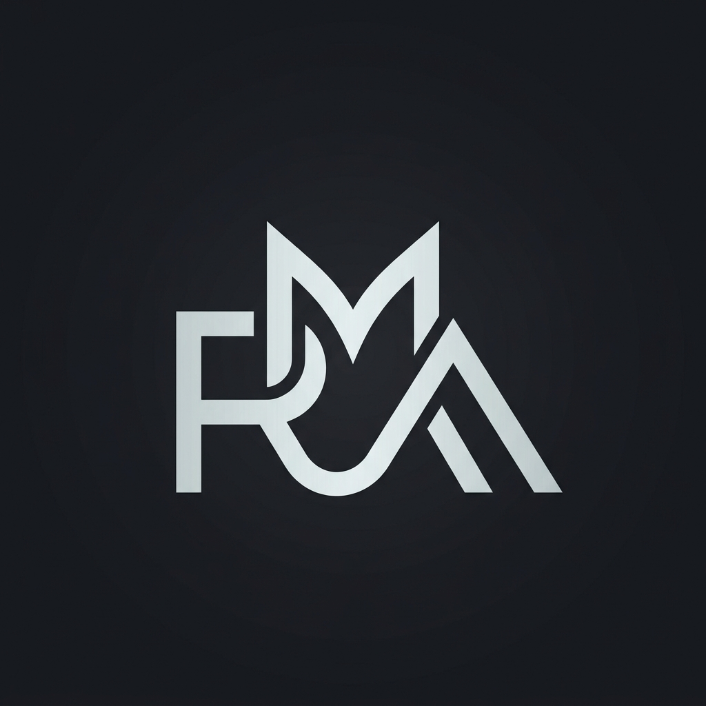
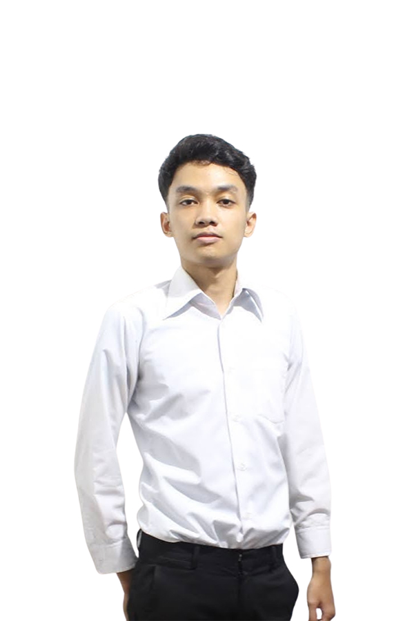

<div align="center">



# Rafii Afif — Portfolio 🚀

[](https://rafii-afif.vercel.app)
[](https://github.com/rafiimafif)
[](https://linkedin.com/in/rafii-muhammad-afif)
[](https://rafii-afif.vercel.app)

<p align="center">
  
</p>

<h3>DevOps Engineer · Cloud Infrastructure Specialist · Bandung, Indonesia</h3>

[🌐 View Live](https://rafii-afif.vercel.app) · [🐛 Report Bug](https://github.com/rafiimafif/Personal-portfolio/issues)

<br/>



</div>

---

## 🌟 Overview

A modern, fully responsive personal portfolio built with **React 18 + Vite** and **Tailwind CSS**. Designed to showcase my skills, projects, and professional experience as a **DevOps Engineer**, focusing on Cloud Infrastructure, CI/CD, Containerization, and Automation.

---

## ✨ Features

<div align="center">

| Feature | Description |
|---------|-------------|
| 🎨 Dark Theme | Sleek dark UI with subtle background and gradient accents |
| 📱 Fully Responsive | Optimized for mobile, tablet and desktop viewing |
| ⚡ Vite Powered | Lightning-fast development and optimized production builds |
| 🎭 Framer Motion | Smooth scroll animations and page transitions |
| 🤖 SEO Optimized | Per-page meta tags, JSON-LD structured data, sitemap |
| 🚀 Vercel Deployment | CI/CD enabled seamless deployments |

</div>

---

## 🚀 Tech Stack & Skills

<div align="center">

| Category | Technologies |
|----------|-------------|
| **CI/CD & Automation** | Jenkins, GitHub Actions |
| **Containerization** | Docker, OpenShift |
| **Cloud & Infrastructure** | AWS |
| **Scripting & OS** | Linux (Ubuntu, Kali), Windows, Bash, Python, PHP |
| **Collaboration & ITSM** | Jira, Confluence, ServiceNow, Active Directory |
| **Frontend Framework** | React 18, Vite, Tailwind CSS |

</div>

---

## 🎯 Portfolio Sections

<div align="center">

| Section | Description |
|---------|-------------|
| 🏠 Home | Introduction and quick links |
| 👨‍💻 About | Background, professional achievements |
| 📂 Projects | Infrastructure and automation projects |
| 💼 Experience | Professional roles (AXA Insurance, Great Eastern, Accelbyte, Hubster) |
| 🎓 Education | B.Sc. Informatics Engineering — Universitas Jenderal Achmad Yani |
| 🛠️ Skills | Categorized technical skills |
| 🏆 Certificates | CCNA, ITIL v4, Jira, End-to-End DevOps |

</div>

---

## 🛠️ Quick Start

```bash
# Clone the repository
git clone https://github.com/rafiimafif/Personal-portfolio.git

# Navigate to project
cd Personal-portfolio

# Install dependencies
npm install

# Start development server
npm run dev
```

---

## 📞 Connect with Me

<div align="center">

[](mailto:rafii.afif@gmail.com)
[](https://linkedin.com/in/rafii-muhammad-afif)

</div>

---

## 📈 GitHub Stats

<div align="center">

[](https://github.com/rafiimafif)

[](https://github.com/rafiimafif)

</div>

---

## 📄 License

<div align="center">

This project is licensed under the **MIT License**.

[](https://visitorbadge.io/status?path=rafiimafif%2FPersonal-portfolio)

</div>